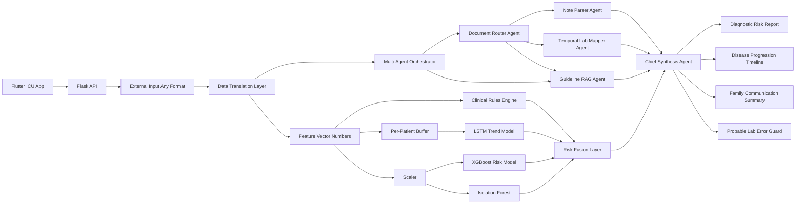

# ICU Risk Backend

Backend for **Agentic Diagnosis Risk Assistant for ICU Complication Detection**.

## What This Backend Does

- Ingests ICU vital-sign snapshots.
- Ingests complex ICU history with vitals, lab results, and unstructured notes.
- Maintains a per-patient time-series buffer for sequence modeling.
- Lets doctors create a patient case, upload prescription/clinical documents and lab documents, then route them into the agentic pipeline.
- Supports report-image intake for prescriptions and lab documents, including image normalization plus optional OCR when a local OCR backend is available.
- Combines:
  - XGBoost for tabular deterioration risk
  - Isolation Forest for anomaly detection
  - LSTM for temporal trend detection
  - Clinical rules for explainable bedside alerts
- Runs a multi-agent clinical synthesis pipeline:
  - Document Router Agent
  - Note Parser Agent
  - Temporal Lab Mapper Agent
  - Guideline RAG Agent
  - Chief Synthesis Agent
  - Family Communication Agent
- Returns a doctor-friendly warning message plus recommended actions.
- Generates a disease-progression timeline, explicit safety caveat, and probable lab-error flags.
- Produces a compassionate family-facing update in English and Hindi with a plain-language summary of the last 12 hours.

## Architecture Diagram



## Backend Modules

- `app.py`: Flask API and request routing.
- `agent.py`: Core inference engine, data-translation orchestration, per-patient buffering, score fusion, recent alerts.
- `clinical_rules.py`: Explainable physiological flags and recommended actions.
- `config.py`: Shared paths, feature names, thresholds, and normal ranges.
- `diagnostic_agents.py`: Multi-agent orchestration for notes, labs, RAG retrieval, and chief synthesis.
- `doctor_workflow.py`: Doctor patient-case registry, document upload preprocessing, routing, and stored reports.
- `train_all.py`: Full training pipeline for XGBoost, Isolation Forest, and LSTM.
- `data/medical_guidelines.json`: Curated medical guideline corpus for RAG-style retrieval.
- `preprocessing/`: Translation layer for JSON, FHIR, HL7, and text plus feature-vector building/scaling.

## API Endpoints

### `GET /health`

Returns model/dependency status.

### `GET /metadata`

Returns feature list, thresholds, ranges, and request examples.

### `GET /alerts/recent?limit=10`

Returns recent warning/critical alerts for the dashboard.

### `POST /predict`

Single-patient prediction. The endpoint accepts:

- canonical JSON feature payloads
- raw JSON with external field aliases
- FHIR Observation or Bundle payloads
- HL7 ORU/OBX text
- free-text vitals such as `HR 122, BP 88/55, SpO2 90, Temp 38.6, RR 28`

Example body:

```json
{
  "patient_id": "ICU-17",
  "timestamp": "2026-04-03T10:15:00Z",
  "features": {
    "HR": 122,
    "BP_sys": 88,
    "BP_dia": 55,
    "Temp": 38.6,
    "SpO2": 90,
    "Resp": 28
  }
}
```

Example plain-text body:

```text
Patient ICU-17 at 2026-04-03T10:15:00Z: HR 122, BP 88/55, Temp 38.6 C, SpO2 90%, RR 28
```

### `POST /predict/batch`

Batch scoring for dashboards or simulation streams.

### `POST /diagnostic-report`

Builds an agentic ICU diagnostic-risk report from:

- structured vitals
- structured lab timelines
- unstructured clinical notes

The response includes:

- disease progression timeline
- flagged risks with guideline citations
- explicit safety caveat
- probable lab-error detection that blocks diagnosis updates until redraw

Example request file:

```bash
cat backend/sample_diagnostic_report_request.json
```

Example curl (backend defaults to port 5001):

```bash
curl -X POST http://127.0.0.1:5001/diagnostic-report \
  -H "Content-Type: application/json" \
  --data @backend/sample_diagnostic_report_request.json
```

### Doctor Case Workflow

Doctors can create a persistent patient case, upload prescription or lab documents, and then generate a combined report where:

- prescription / clinical documents are preprocessed into note entries for the Note Parser Agent
- lab documents are preprocessed into structured lab values for the Temporal Lab Mapper Agent
- uploaded images are normalized before OCR/text extraction so scanned prescriptions and report photos can feed the same routing flow
- the Guideline RAG Agent retrieves supporting citations from the evidence produced downstream
- the Chief Synthesis Agent combines notes, labs, vitals, ML risk, and guideline evidence
- the Family Communication Agent turns the technical assessment into a compassionate, jargon-free English and Hindi family update

Endpoints:

- `GET /doctor/patients`
- `POST /doctor/patients`
- `GET /doctor/patients/<patient_id>`
- `POST /doctor/patients/<patient_id>/documents`
- `POST /doctor/patients/<patient_id>/analyze`
- `GET /doctor/patients/<patient_id>/report`

Create a patient case with immediate analysis (API served on port 5001):

```bash
curl -X POST http://127.0.0.1:5001/doctor/patients \
  -H "Content-Type: application/json" \
  --data @backend/sample_doctor_case_request.json
```

Upload text or JSON files later with multipart form-data:

```bash
curl -X POST "http://127.0.0.1:5001/doctor/patients/ICU-501/documents?analyze=true" \
  -F "files=@prescription.txt" \
  -F "document_type=prescription" \
  -F "author=Dr. Meera" \
  -F "specialty=Critical Care"
```

Upload a prescription or lab-report image with optional clinician context:

```bash
curl -X POST "http://127.0.0.1:5001/doctor/patients/ICU-501/documents?analyze=true" \
  -F "files=@lab-report.png" \
  -F "document_type=lab_report" \
  -F "title=Portable chemistry image" \
  -F "content=Possible sepsis workup image from ward phone capture." \
  -F "author=Dr. Meera" \
  -F "specialty=Critical Care"
```

Notes:

- Image preprocessing is built in via Pillow.
- OCR runs when `pytesseract` is installed and a local `tesseract` binary is available on the machine running the backend.
- If OCR is unavailable, the upload still succeeds and the doctor can provide optional context text that continues through the agent pipeline.

### Frontend API base URL

- The Flutter client defaults to `http://127.0.0.1:5001` (web/desktop) and `http://10.0.2.2:5001` (Android emulator).
- Override with `API_BASE_URL=<url>` at build/run time if your backend runs elsewhere.

### PostgreSQL persistence (optional, local-first)

- The backend can persist doctor cases in a local PostgreSQL database.
- Requirements: `psycopg[binary]` (already listed) and a reachable PostgreSQL database.
- Preferred config: set `ICU_DATABASE_URL=postgresql://<user>:<password>@127.0.0.1:5432/<db>`.
- Alternative config: set `POSTGRES_DB`, and optionally `POSTGRES_USER`, `POSTGRES_PASSWORD`, `POSTGRES_HOST`, `POSTGRES_PORT`.
- The backend auto-creates a `doctor_cases` table on startup when PostgreSQL is reachable.
- If PostgreSQL is not configured or reachable, the service falls back to local JSON files in `backend/data/doctor_cases/`.

## Training Flow

1. Load and validate ICU time-series data.
2. Split train/test by `Patient_ID` to prevent leakage.
3. Fit the scaler on train data only.
4. Train XGBoost on tabular features.
5. Train Isolation Forest for anomaly detection.
6. Build per-patient sequences and train the LSTM.
7. Save all models plus `metadata.json`.

## Run Locally

```bash
cd backend
python3.11 -m venv .venv
source .venv/bin/activate
pip install -r requirements.txt
createdb icu_agent  # if you do not already have a local postgres database
export ICU_DATABASE_URL=postgresql://postgres@127.0.0.1:5432/icu_agent
export ICU_BACKEND_PORT=5001
python train_all.py
python app.py
```

Use Python `3.11` or `3.12` for the full stack. In the current workspace, `python3` is `3.14.0`, which does not support TensorFlow yet. If you must stay on `3.14`, install the backend dependencies and run `python train_all.py --skip-lstm` for a tabular-plus-anomaly version without the LSTM.

## Hackathon Pitch Summary

- Problem: nurses and doctors can miss subtle deterioration patterns in high-load ICU settings.
- Solution: an agentic ICU assistant that fuses temporal vitals, lab histories, and unstructured notes, then cites relevant clinical guidance in a single diagnostic-risk report.
- Value: earlier escalation, safer handoffs, lab-error awareness, fewer missed trends, and clearer decision support for clinicians.
