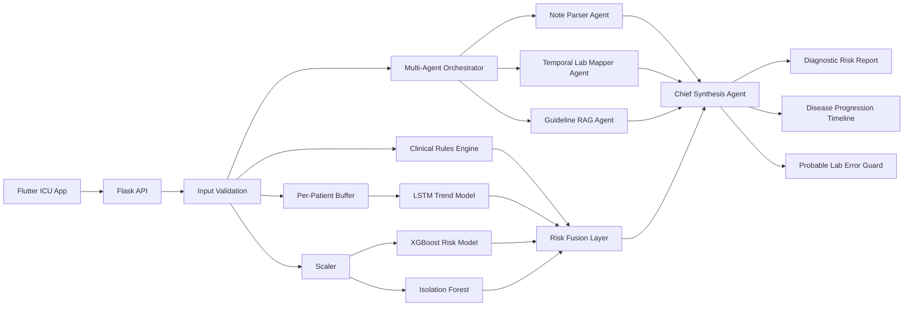

# ICU Risk Backend

Backend for **Agentic Diagnosis Risk Assistant for ICU Complication Detection**.

## What This Backend Does

- Ingests ICU vital-sign snapshots.
- Ingests complex ICU history with vitals, lab results, and unstructured notes.
- Maintains a per-patient time-series buffer for sequence modeling.
- Combines:
  - XGBoost for tabular deterioration risk
  - Isolation Forest for anomaly detection
  - LSTM for temporal trend detection
  - Clinical rules for explainable bedside alerts
- Runs a multi-agent clinical synthesis pipeline:
  - Note Parser Agent
  - Temporal Lab Mapper Agent
  - Guideline RAG Agent
  - Chief Synthesis Agent
- Returns a doctor-friendly warning message plus recommended actions.
- Generates a disease-progression timeline, explicit safety caveat, and probable lab-error flags.

## Architecture Diagram



## Backend Modules

- `app.py`: Flask API and request routing.
- `agent.py`: Core inference engine, per-patient buffering, score fusion, recent alerts.
- `clinical_rules.py`: Explainable physiological flags and recommended actions.
- `config.py`: Shared paths, feature names, thresholds, and normal ranges.
- `diagnostic_agents.py`: Multi-agent orchestration for notes, labs, RAG retrieval, and chief synthesis.
- `train_all.py`: Full training pipeline for XGBoost, Isolation Forest, and LSTM.
- `data/medical_guidelines.json`: Curated medical guideline corpus for RAG-style retrieval.

## API Endpoints

### `GET /health`

Returns model/dependency status.

### `GET /metadata`

Returns feature list, thresholds, ranges, and request examples.

### `GET /alerts/recent?limit=10`

Returns recent warning/critical alerts for the dashboard.

### `POST /predict`

Single-patient prediction.

Example body:

```json
{
  "patient_id": "ICU-17",
  "timestamp": "2026-04-03T10:15:00Z",
  "features": {
    "HR": 122,
    "BP_sys": 88,
    "BP_dia": 55,
    "Temp": 38.6,
    "SpO2": 90,
    "Resp": 28
  }
}
```

### `POST /predict/batch`

Batch scoring for dashboards or simulation streams.

### `POST /diagnostic-report`

Builds an agentic ICU diagnostic-risk report from:

- structured vitals
- structured lab timelines
- unstructured clinical notes

The response includes:

- disease progression timeline
- flagged risks with guideline citations
- explicit safety caveat
- probable lab-error detection that blocks diagnosis updates until redraw

Example request file:

```bash
cat backend/sample_diagnostic_report_request.json
```

Example curl:

```bash
curl -X POST http://127.0.0.1:5001/diagnostic-report \
  -H "Content-Type: application/json" \
  --data @backend/sample_diagnostic_report_request.json
```

## Training Flow

1. Load and validate ICU time-series data.
2. Split train/test by `Patient_ID` to prevent leakage.
3. Fit the scaler on train data only.
4. Train XGBoost on tabular features.
5. Train Isolation Forest for anomaly detection.
6. Build per-patient sequences and train the LSTM.
7. Save all models plus `metadata.json`.

## Run Locally

```bash
cd backend
python3.11 -m venv .venv
source .venv/bin/activate
pip install -r requirements.txt
python train_all.py
python app.py
```

Use Python `3.11` or `3.12` for the full stack. In the current workspace, `python3` is `3.14.0`, which does not support TensorFlow yet. If you must stay on `3.14`, install the backend dependencies and run `python train_all.py --skip-lstm` for a tabular-plus-anomaly version without the LSTM.

## Hackathon Pitch Summary

- Problem: nurses and doctors can miss subtle deterioration patterns in high-load ICU settings.
- Solution: an agentic ICU assistant that fuses temporal vitals, lab histories, and unstructured notes, then cites relevant clinical guidance in a single diagnostic-risk report.
- Value: earlier escalation, safer handoffs, lab-error awareness, fewer missed trends, and clearer decision support for clinicians.
